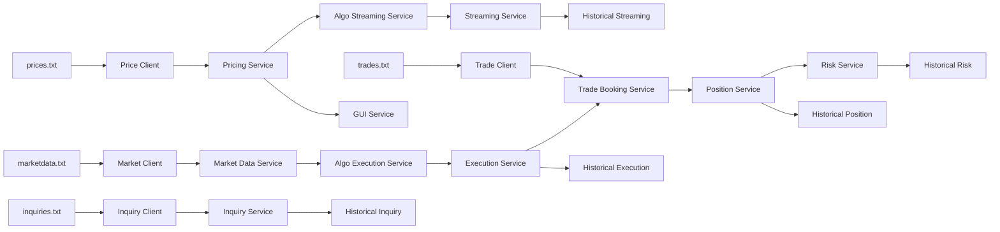

# BondTrader for Study

BondTrader for Study 是一个基于 C++ 和 Boost.Asio 实现的固定收益交易系统学习项目。项目以美国国债 Bond 为主要交易产品，模拟价格、订单簿、成交、询价等数据输入，并通过多个业务服务模块完成行情处理、算法报价、算法执行、交易记账、持仓计算、风险计算和历史数据落盘。

> 本项目用于学习 C++ 服务端开发、异步网络通信和金融交易系统模块设计，不连接真实交易所，也不包含真实生产级撮合、清算、风控或合规能力。

## 项目特点

- 基于 **Boost.Asio** 实现 TCP Socket 数据输入与服务间数据发布。
- 使用 **Service / Listener** 事件通知模式组织业务链路，降低服务之间的直接耦合。
- 支持价格、订单簿、成交、询价四类输入数据的文件生成与 Socket 传输。
- 实现 `OrderBook` 数据结构，支持最优买卖价获取与订单簿深度聚合。
- 实现 Pricing、MarketData、AlgoStreaming、Streaming、AlgoExecution、Execution、TradeBooking、Position、Risk、HistoricalData、Inquiry、GUI 等交易服务模块。
- 使用 `std::thread` 启动多个服务监听线程，模拟多个交易服务并行运行。
- 使用 CMake 管理项目构建，提供 `run.sh` 脚本完成构建和本地启动。

## 技术栈

| 类别 | 技术 |
| --- | --- |
| 语言 | C++17 |
| 网络通信 | Boost.Asio、TCP Socket |
| 构建工具 | CMake |
| 并发模型 | std::thread |
| 数据格式 | CSV 文本流 |
| 运行环境 | Linux / macOS |

## 系统架构

项目采用事件驱动的服务链路。外部数据通过文件客户端写入本地 TCP 服务，服务处理后通过 Listener 回调继续传递到下游模块。



## 服务模块说明

| 模块 | 说明 |
| --- | --- |
| `PricingService` | 接收债券价格数据，维护最新价格，并通知报价和 GUI 相关服务。 |
| `MarketDataService` | 接收订单簿行情，维护买卖盘，支持最优买卖价和深度聚合。 |
| `AlgoStreamingService` | 根据价格生成双边报价流。 |
| `StreamingService` | 发布双边报价，并将报价结果写入历史数据服务。 |
| `AlgoExecutionService` | 根据订单簿行情生成算法执行指令。 |
| `ExecutionService` | 发布执行订单，并将执行结果传递给交易记账模块。 |
| `TradeBookingService` | 接收成交数据或执行结果，生成交易记录。 |
| `PositionService` | 根据交易记录维护产品维度持仓。 |
| `RiskService` | 基于持仓计算 PV01 风险。 |
| `HistoricalDataService` | 将持仓、风险、执行、报价、询价等结果落盘。 |
| `InquiryService` | 处理客户询价数据，并记录询价状态。 |
| `GUIService` | 对价格数据进行节流输出，模拟 GUI 展示数据源。 |

## 端口约定

| 端口 | 服务 | 输入来源 |
| --- | --- | --- |
| `3000` | Pricing Service | `prices.txt` |
| `3001` | Market Data Service | `marketdata.txt` |
| `3002` | Trade Booking Service | `trades.txt` |
| `3003` | Inquiry Service | `inquiries.txt` |
| `3004` | Streaming Service | 内部报价发布 |
| `3005` | Execution Service | 内部执行发布 |

## 目录结构

```text
BondTrader_for_study
├── CMakeLists.txt
├── main.cpp
├── run.sh
├── InputPriceConnector.cpp
├── InputMarketConnector.cpp
├── InputTradeConnector.cpp
├── InputInquiryConnector.cpp
└── headers
    ├── products.hpp
    ├── soa.hpp
    ├── pricingservice.hpp
    ├── marketdataservice.hpp
    ├── algostreamingservice.hpp
    ├── streamingservice.hpp
    ├── algoexecutionservice.hpp
    ├── executionservice.hpp
    ├── tradebookingservice.hpp
    ├── positionservice.hpp
    ├── riskservice.hpp
    ├── inquiryservice.hpp
    ├── historicaldataservice.hpp
    ├── guiservice.hpp
    ├── fileconnector.hpp
    └── utils.hpp
```

运行时会自动生成以下目录：

```text
data/   # 生成的输入数据，包括 prices、marketdata、trades、inquiries
res/    # 服务处理结果，包括 positions、risk、executions、streaming、allinquiries、gui
build/  # CMake 构建目录
```

## 构建与运行

### 1. 安装依赖

请先确保本地环境已安装：

- C++17 编译器，例如 `g++` 或 `clang++`
- CMake 3.1.2 或以上版本
- Boost 开发库

Ubuntu / Debian 环境可参考：

```bash
sudo apt update
sudo apt install -y build-essential cmake libboost-all-dev
```

macOS 环境可参考：

```bash
brew install cmake boost
```

### 2. 一键运行

```bash
bash run.sh
```

脚本会完成以下操作：

1. 创建 `build/` 目录；
2. 使用 CMake 生成构建文件；
3. 编译 `server`、`price`、`market`、`trade`、`inquiry`；
4. 启动服务端；
5. 依次启动价格、交易、订单簿和询价客户端；
6. 将处理结果写入 `res/` 目录。

### 3. 手动构建

```bash
mkdir -p build
cd build
cmake ..
make -j8
```

启动服务端：

```bash
./server
```

在其他终端中启动客户端：

```bash
./price
./trade
./market
./inquiry
```

## 输入与输出

### 输入数据

程序启动后会在 `data/` 目录下生成模拟数据：

| 文件 | 内容 |
| --- | --- |
| `prices.txt` | 债券价格数据 |
| `marketdata.txt` | 债券订单簿数据 |
| `trades.txt` | 成交数据 |
| `inquiries.txt` | 客户询价数据 |

### 输出结果

服务处理结果会写入 `res/` 目录：

| 文件 | 内容 |
| --- | --- |
| `positions.txt` | 持仓结果 |
| `risk.txt` | PV01 风险结果 |
| `executions.txt` | 执行订单结果 |
| `streaming.txt` | 双边报价流结果 |
| `allinquiries.txt` | 询价处理结果 |
| `gui.txt` | GUI 价格展示数据 |

## 核心设计

### 1. Service / Listener 事件驱动模型

项目中每个业务模块都以 Service 的形式对外提供数据处理能力，并通过 Listener 接收上游事件、通知下游服务。该设计使不同业务模块只依赖统一的回调接口，而不需要直接耦合具体实现。

典型链路示例：

```text
PricingService
    -> AlgoStreamingService
    -> StreamingService
    -> HistoricalDataService
```

```text
MarketDataService
    -> AlgoExecutionService
    -> ExecutionService
    -> TradeBookingService
    -> PositionService
    -> RiskService
    -> HistoricalDataService
```

### 2. Boost.Asio 异步网络通信

输入数据通过 FileConnector 从本地文件读取，并通过 TCP Socket 发送到对应服务端口。服务端 Connector 使用 Boost.Asio 监听端口，并基于异步读写处理输入数据。

当前数据传输采用换行分隔的 CSV 文本流，便于调试和观察数据流转。

### 3. OrderBook 订单簿处理

`MarketDataService` 维护债券产品维度的订单簿，支持：

- 买盘 / 卖盘数据维护；
- 最优 Bid / Offer 获取；
- 同价格档位数量聚合；
- 将聚合后的订单簿推送给算法执行服务。

### 4. 交易后处理链路

执行订单和外部成交数据进入 `TradeBookingService` 后，会继续传递到持仓与风险模块：

```text
TradeBookingService -> PositionService -> RiskService
```

其中 `PositionService` 维护产品持仓，`RiskService` 基于持仓计算 PV01，并将结果写入历史数据服务。

## 当前开发状态

本项目是学习型交易系统模拟项目，已经覆盖固定收益交易系统中的主要服务模块和数据流转链路。当前版本重点在于服务端模块拆分、异步通信和事件驱动设计。

后续可以继续完善：

- 修复并统一基础 SOA 抽象层定义，确保全仓库可稳定编译；
- 补充单元测试和端到端运行截图；
- 增加更清晰的日志和异常处理；
- 将当前 CSV 文本流升级为二进制或 Header + Payload 应用层协议；
- 引入线程安全任务队列，完善并发处理模型；
- 增加真实撮合逻辑，例如价格优先、时间优先、部分成交和撤单处理；
- 增加 Redis / MySQL 等持久化或缓存模块。

## 免责声明

本项目仅用于学习 C++、Boost.Asio 和金融交易系统架构设计，不构成任何投资、交易或生产系统建议。
